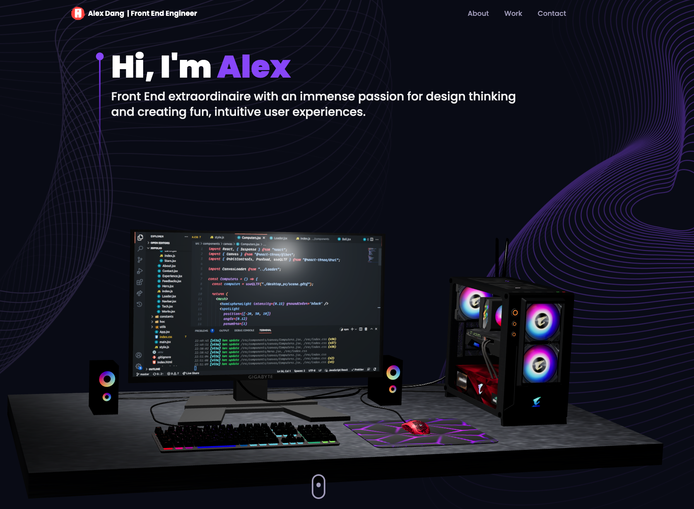

# Alex Dang: Software Engineer Portfolio Website



Welcome to the repository for my personal portfolio website! As a professional software engineer, I've developed and contributed to various projects throughout my career. This website showcases my skills, experiences, and projects that I have worked on.

## Table of Contents

- [Introduction](#introduction)
- [Features](#features)
- [Technologies](#technologies)
- [Installation and Setup](#installation-and-setup)
- [Contribution](#contribution)
- [License](#license)
- [Contact](#contact)

## Introduction

My name is Alex Dang, and I'm a Front End Software Engineer with experience in full-stack development, specializing in web applications and software development. This portfolio website is a collection of my work, experiences, and skillset. Visit at https://www.alexdang.dev. Please take your time to explore my projects, accomplishments, and get to know me better.

## Features

- Responsive design for seamless experience on different devices
- Easy navigation to various sections
- Projects section showcasing projects with descriptions, technologies, and links to live demos and repositories
- Skills section outlining technical expertise and tools
- Experience section listing past work experiences, roles, and accomplishments
- Testimonial section featuring all the nice things previous co-workers said about me at gunpoint(jk)
- Contact section for getting in touch

## Technologies

This website is built using modern web technologies and tools, including:

- TypeScript
- React.js
- Three.js
- Tailwind.css
- Git and GitHub

## Installation and Setup

To run this website locally, follow these steps:

1. Clone the repository:

```bash
git clone https://github.com/alexdang1993374/3D-Portfolio.git
cd 3d-portfolio
```

2. Install dependencies:

```bash
yarn install
```

3. Start the development server:

```bash
yarn dev
```

The website should now be running on `http://localhost:3000`.

## Contribution

If you'd like to contribute or suggest improvements, please feel free to submit a pull request, create an issue, or get in touch.

## License

This project is licensed under the MIT License - see the [LICENSE](LICENSE) file for details.

## Contact

- Email: [alexdang1993374@email.com](mailto:alexdang1993374@email.com)
- LinkedIn: [linkedin.com/in/johndoe](https://www.linkedin.com/in/alexdang1993374/)
- GitHub: [github.com/johndoe](https://github.com/alexdang1993374)

Thank you for visiting my portfolio website repository!
